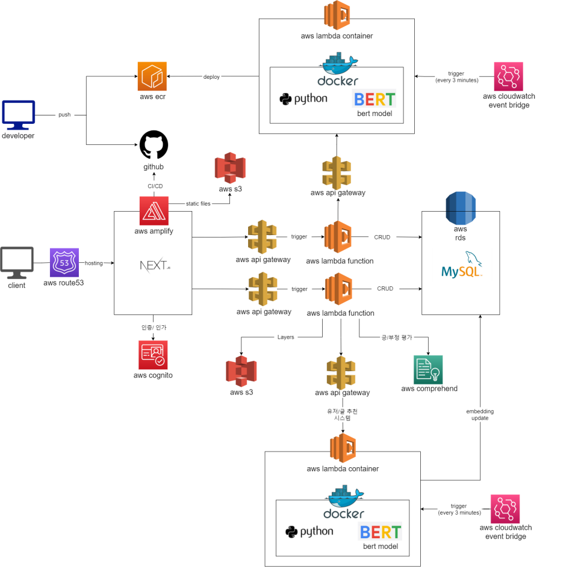

# 내 맘을 위로해조(8조) 완료 보고서

### 정민석 2018106041
고대화 2020121008
최동주 2019125085

---

# 개발  추진 실적

## 마일스톤 점검회의 (주간보고 & 상세 개발 계획)

### 4주차 (3/23 - 3/29)

**개발 계획**

- Backend
    - AWS RDS 테이블 추가
    - AWS RDS - AWS Lambda 연결
- Frontend
    - React 학습 후 로그인 페이지 구현
- Machine Learning
    - BERT 차연어 처리

**실제 개발 진행**

- Common
    - 프로젝트 재 설정으로 인해 제안서, 계획서, 아키텍처 재작성
- Backend
    - AWS RDS 테이블 생성
    - AWS Lambda 학습
- Frontend
    - AWS Amplify 학습
    - AWS Cognito  학습
    - AWS Amplify - Cognito 튜토리얼을 통해 임시 로그인 페이지 구현
    - React js 학습
- Machine Learning
    - 웰니스 정신 건강 상담 data set 준비 ([https://aihub.or.kr/opendata/keti-data/recognition-laguage/KETI-02-006](https://aihub.or.kr/opendata/keti-data/recognition-laguage/KETI-02-006))
    - data set을 test-train set으로 분리
    - test set을 이용하여 적절한 model 선택 (최적의 BERT 모델 정확도 약 0.8)
    - 선택된 pre-trained BERT model import
    

### 5주차 (3/30 - 4/5)

**개발 계획**

- Backend
    - AWS Lambda - AWS API Gateway 연결
- FrontEnd
    - React js 학습 및 챗봇 UI 제작
- Machine Learning
    - BERT 자연어 처리
    - Vector similarity 적합 함수 선택

**실제 개발 진행**

- Backend
    - AWS RDS - AWS Lambda 연결
    - AWS RDS - AWS Lambda를 활용하여 고민-챗봇 위로 응답 CRUD REST API 함수 개발
- Frontend
    - React js 학습 후 로그인, 회원가입 페이지 개발 및 디자인
    - AWS Cognito에서 사용자 관리 구조 및 속성 값 파악
- Machine Learning
    - Vector Similarity 함수로 Cosine similarity 함수 선택
    - 유저의 고민을 넣었을 때 input으로 넣을 때 챗봇 답변, 유사도, 유사한 질문, 구분을 output으로 뽑을 수 있도록 개발

### 6주차 (4/6 - 4/12)

**개발 계획**

- Backend
    - 개발된 챗봇 모델을 서비스에 적용
- Frontend
    - React js 학습 및 챗봇 UI 제작

**실제 개발 진행**

- Backend
    - 고민-챗봇 위로 CRUD REST API 개발
    - 개발된 모델을 Python-flask 연동 및 AWS ec2 배포(1)
- Frontend
    - 오프닝 페이지, 메인 페이지 개발
- Machine Learning
    - 챗봇 모델 안정성 테스트
    

### 7주차 (4/13 - 4/19)

**개발 계획**

- Backend
    - 챗봇 모델을 AWS ec2에 Python-flask 서버로 배포 후 postman 테스트
- Frontend
    - 커뮤니티 세부 디자인
    - 협업을 위해 AWS Amplify setting
    - 오프닝 페이지 및 회원 인증 UI 수정

**실제 개발 진행**

- Backend
    - 개발된 모델을 Python-flask 연동 및 AWS ec2 배포(2)
- Frontend
    - 오프닝 페이지 및 회원 인증 UI 수정
    - SSR을 해보기 위해 Next js 도입 검토 및 학습
- Machine Learning
    - 챗봇 모델의 부적절한 답변 처리 완료

### 8주차 (4/20 - 4/26)

**개발 계획**

- Backend
    - 챗봇 모델을 AWS ec2 / GCP e2가 아닌 AWS Lambda로 서비싱 할 수 있는 방법 검색 및 고안
    - 중간 발표 때 피드백 받은 API 보안 문제 해결책 검색 및 고안
    - 커뮤니티 기능에 맞춰 AWS Lambda CRUD REST API 수정 및 개발
- Frontend
    - Next js 학습 및 문서작성
    - React js → Next js 일부 마이그레이션
    - 타입 스크립트 이해
    - 소셜 로그인 문제 해결
    - AWS Cognito 보안 개선

**실제 개발 진행**

- Backend
    - 챗봇 모델을 AWS ec2 / GCP e2가 아닌 AWS Lambda로 서비싱 할 수 있는 솔루션 확인
    - 커뮤니티 기능 도입에 따라 기존 AWS Lambda REST API 수정 및 개발
- Frontend
    - Next js 학습 및 문서 작성 ([https://tidal-waterlily-dda.notion.site/NEXT-c18580b8237d4736a26f586a5ef3d482](https://www.notion.so/NEXT-c18580b8237d4736a26f586a5ef3d482))
    - 중간 발표 때 피드백 받은 AWS Cognito 보안 개선 (Access key & Secret key 환경 변수 설정)
    - 오프닝 페이지 요소 추가

 ****

### 9주차 (4/27 - 5/3)

**개발 계획**

- Backend
    - 챗봇을 AWS ec2 Python-flask 서버에서 AWS Lambda Container로 마이그레이션 진행
- Frontend
    - Next js 문서 보충
    - React js → Next js 일부 마이그레이션
    - AWS Amplify - Next js 연동 시도

**실제 개발 진행**

- Backend
    - AWS Lambda Container로 마이그레이션 진행하기 위해 Docker, AWS cli, AWS ecr, AWS Lambda Container, git lfs 학습 진행
    - Dockerfile에 필요한 레이어 작성
    - AWS Lambda Container에 대한 test 성공
- Frontend
    - Next js 학습
    - Next js를 활용하여 메인 페이지 레이아웃 제작

 ****

### 10주차 (5/4 - 5/10)

**개발 계획**

- Backend
    - 챗봇을 AWS ec2 Python-flask 서버에서 AWS Lambda Container로 마이그레이션 진행
- Frontend
    - Next js를 활용하여 메인 페이지 작성
    - React js → Next js 마이그레이션 완료

**실제 개발 진행**

- Backend
    - 챗봇을 AWS ec2 Python-flask 서버에서 AWS Lambda Container로 마이그레이션 진행
- Frontend
    - Next js 메인 페이지 작성 및 기본 라우팅 연결
    - React js → Next js 마이그레이션 완료

 ****

### 11주차 (5/11 - 5/17)

**개발 계획**

- Backend
    - 댓글, 힘내요 기능 AWS Lambda CRUD REST API 작성
    - 챗봇 AWS Lambda Container에서 response json parsing 부분 디버깅
- Frontend
    - Next js 메인 페이지 추가 개발

**실제 개발 진행**

- Backend
    - 댓글, 힘내요 기능 AWS Lambda CRUD REST API 작성 완료
    - AWS Lambda Layer 추가
    - 챗봇 AWS Lambda Container에서 response json parsing 부분 디버깅
- Frontend
    - 메인 페이지 추가 개발
    - 카테고리 대분류 및 게시판 ui 제작

 ****

### 12주차 (5/18 - 5/24)

**개발 계획**

- Backend
    - AWS Lambda REST API 보완
    - Frontend에서 필요한 REST API 추가 개발
- Frontend
    - 메인 페이지 디자인
    - 챗봇 ui 제작
    - 상세 게시판 제작

**실제 개발 진행**

- Backend
    - 개발 완료된 AWS Lambda REST API 리팩토링
    - 게시판 CRUD REST API 추가 개발
- Frontend
    - 게시판 페이지 디자인
    - Next js 라우팅 개발
    - AWS Lambda REST API 연결을 위해 테스트
    - 챗봇 ui 제작
    - 상세 게시판 제작

 ****

### 13주차 (5/25 - 5/31)

**개발 계획**

- Backend
    - AWS Comprehend를 사용한 감정 분석 추가
    - Frontend - AWS Lambda REST API 연동시 발생하는 CORS 문제 해결
    - AWS API Gateway 보안을 위해 api-key 추가
- Frontend
    - 보드 페이지 디자인
    - 개발된 Backend API 연동

**실제 개발 진행**

- Backend
    - AWS Comprehend를 사용하여 긍/부정 수치 추가
    - AWS API Gateway option method 추가, response header를 추가하여 CORS 문제 해결
    - AWS API Gateway api-key를 추가하여 보안성 강화
    - AWS Lambda Container cold start 방지를 위해 cloud watch event 추가 (3분에 한번씩 trigger)
- Frontend
    - 보드 페이지 디자인
    - 챗봇 ui, 상세 게시판 제작
    - 개발된 백엔드 API 연동

 ****

### 14주차 (6/1 - 6/7)

**개발 계획**

- Backend
    - 유저, 글 기반 다른 글 추천할 수 있는 추천시스템 개발
    - 아키텍처 추가 확장
- Frontend
    - 서버와 챗봇 연결
    - 댓글 디자인
    - 메인 페이지 사진 변경

**실제 개발 진행**

- Backend
    - 유저, 글 기반 다른 글 추천할 수 있는 추천시스템 개발 완료
    - 검색 기능 제작을 위해 sql 쿼리 수정
- Frontend
    - 로그인 세션 유지, 로그아웃 정상화
    - 내가 쓴 글 보기 페이지 개발
    - 헤더 디자인
    - 검색 기능 추가
    - 서버와 챗봇 연결하여 동작 확인

 ****

---

## 중간보고 내용

## Github URL

- AWS Lambda Backend: [https://github.com/JamesWithCode/aws-comfortme-project](https://github.com/JamesWithCode/aws-comfortme-project)
- Next js Frontend: [https://github.com/daehwa00/industry_kau](https://github.com/daehwa00/industry_kau)

# 완성된 서비스 framework

## 사용된 기술 스택

### IDE

- vscode
- Jupyter Notebook
- Jetbrain Datagrip

### AWS

- Amlify
- Cognito
- Api Gateway
- Lambda
    - Function
    - Container
- Ecr
- RDS
- Cloudwatch eventbridge
- Comprehend
- S3
- Route 53

### Frontend

- React js
- Next js

### etc

- Mysql
- Docker
- Flask
- Anaconda
- Git
- Github

## 아키텍처

### 전체 아키텍처



### 아키텍처 세부 설명


- **호스팅&클라이언트**
    - 호스팅
        1. 사전 가비에서 구입된 도메인의 호스팅을 aws route53 DNS name server로 변경
        2. aws amplify와 aws route53을 연결하여 호스팅
    - 클라이언트
        1. aws amplify에서 github에 대한 CI/CD
        2. Next js → PaaS 방식으로 deploy되어 client 서비싱
        3. 사용자 인증 인가에 대한 부분은 aws cognito와 연동되어 진행 → user pool에 user info 저장됨
- **CRUD REST API**
    1. aws api gateway로 HTTP 요청을 보내면 연결된 aws lambda를 trigger
    2. aws lambda에서 사전 정의된 function을 통해서 processing 후 aws rds(mysql)로 CRUD 작업 진행
- **챗봇**
    1. 로컬 → lambda function 및 Dockerfile 작성 
    2. Dockerfile build → aws ecr tag 추가 → aws cli를 사용하여 aws ecr에 push
    3. aws lambda container에서 aws ecr에 있는 image deploy
    4. aws api gateway를 통해 request(trigger)&response
    5. cold start 방지를 위해 aws cloudwatch event bridge를 사용하여 주기적으로 trigger
- **관련 글 추천**
    - post 임베딩 생성
        1. 새로운 post가 생성될 때마다 aws api gateway → aws lambda container를 trigger하여 해당 post에 대한 bert embedding 생성
        2. 생성된 bert embedding을 aws rds(mysql)에 post의 bertEmbedding column에 저장
    - post-based recommendation
        1. 특정 글에 대한 임베딩 벡터 값과 db에 존재하는 post들의 embedding 값을 cosine similarity function으로 유사도 계산
        2. 유사도가 높은 순으로 내림차순 정렬하여 상위 5개 글 추천 (특정 글에 대한 관련 글을 추천하는 방식)
    - user 임베딩 생성
        1. 처음에 유저에 대한 임베딩 디폴트 값은 0 (관련 글 추천을 해줄 수 없는 상태)
        2. 해당 유저가 post를 작성하면 작성한 post에 대한 임베딩이 구해지고, 기존의 유저 임베딩에  합을하여 aws rds(mysql)에 유저 임베딩을 업데이트 (벡터의 방향성이 생김)
    - user-base recommendation
        1. 누적된 유저 임베딩 벡터 값과 db에 존재하는 post들의 embedding 값을 cosine similarity function으로 유사도 계산
        2. 유사도가 높은 순으로 내림차순 정렬하여 상위 5개 글 추천 (임의의 유저에 대한 관련 글을 추천하는 방식)
- **긍/부정 평가**
    1. 새로운 post가 생성될 때 aws comprehend api로 request
    2. 해당 post의 contents에 대한 positive rate와 negative rate를 response로 받음

---

# 문제점 및 해결 내용 (개별 보고)

## 정민석

### AWS ec2 - flask web server→ AWS lambda container - AWS api gateway 마이그레이션


기존에 사용하던 aws ec2-flaks web server


새롭게 마이그레이션 된 aws lambda container

중간 발표 때까지는 챗봇의 서비싱을 위해 aws ec2 위에 flask web server를 구동시켰다.

하지만 사용하지 않을 때 너무 많은 리소스가 낭비가 될 수 있다는 피드백을 받아 챗봇을 aws lambda conatiner 위에서 서비싱 할 수 있도록 마이그레이션을 진행하였다.

### AWS Lambda Container의 Cold start 문제

일정 시간동안 aws lambda container를 trigger 시켜주지 않으면 인스턴스가 내려가서 요청이 가지 않는 문제 발생했다.

주기적으로 해당 container를 trigger 시켜줄 수 있도록 Amazon EventBridge를 추가


모든 aws lambda container들에 대해 주기적인 trigger event를 발생시켜 cold start 문제를 해결하였다.

### AWS API Gateway REST API api-key 추가를 통한 보안 강화

중간 발표 때 aws api gateway REST API의 보안 문제를 피드백 받았다. 

기존에는 아무 api-key 없이도 요청을 보낼 수 있었다. 따라서 api-key를 header에 추가해야만 REST API에 접근할 수 있도록 추가하였다.


aws api gateway에 api-key가 새롭게 추가된 상태


헤더에 x-api-key가 추가되지 않은 상태로 요청을 보내면 403 Forbidden(권한 없음) response를 받는다.


헤더에 x-api-key를 추가하여 요청을 보내면 200 OK response를 받는다.

### 프론트엔드에서 AWS API Gateway로 API 호출 시 발생하는 CORS 문제 해결


프론트엔드와 aws api gateway - aws lambda로 개발된 REST API를 연동하는 과정에서 CORS 문제가 발생했다.


프론트엔드에서 HTTP methods(get, post)로 ajax 요청을 하기 전에 options 메서드로 preflight request를 보내게 되는데 aws api gateway에서는 해당 request에 대해 response를 해줄 수 있는 options 메서드가 설정되어 있지 않았다. 따라서 추가해주었다.


또한 lambda function 코드 상에서도 response를 해줄 때 ‘Access-Control-Allow-Origin’ header를 추가하여 CORS 문제가 발생하지 않도록 하였다. 

## 고대화

### 챗봇 구현에서의 적절하지 않은 대답을 내보낼 때의 문제

200개 이상의 카테고리와 4000개이상의 데이터셋이 있다고 하더라도,

고민과 상관없는 이상한 입력이 들어왔을 경우 적합한 출력을 내보내지 못하는 문제 발생

이때 GPT 모델을 따로 사용하고자 하였으나, ko-gpt는 개발이 아직 완료되지 않았으며, 리소스도 굉장히 많이 차지하기 때문에

따로 게시판으로 글을 작성하도록 우회하도록 하여 해결하였음.

### 리액트에서의 서버사이드렌더링 문제

리액트는 기본적으로 서버사이드렌더링을 제공하지 않음.

이번 프로젝트에서 서버사이드렌더링을 제공하여 편리한 유저 경험을 제공하고 싶었음.

따라서 기본 리액트로 진행하던 프로젝트를 NEXT.js 로 마이그레이션 하여 서버사이드렌더링 환경을 제공하였음.

### 로그인 유지의 문제

로그인을 유지하려고 하였으나, 새로고침을 하거나 페이지를 이동할 경우 로그인이 해제되는 경우가 발생하는 문제가 있었음

따라서 cognito에 요청을 한 후 성공적으로 로그인이 되었다면 쿠키에 저장하여 로그인 정보를 계속해서 불러오는 방식으로 해결하였음.


### 성능 하락의 문제

프론트를 구축하며, 네트워크나 컴퓨팅 리소스를 쓸데없이 많이 호출하거나, 함수를 계속 요청하는 것을 발견하였음.

이를 React.memo() 함수나 useEffect등으로 적절한 경우에 호출하도록 하였고,

또한 서버의 부하를 줄이기 위해 적절하지 않은 요청일 경우 프론트측에서 차단하여 요청을 보내지 않도록 프로그래밍 하였음.

## 최동주

### Amplify에서 로그인 시 보안 문제

로그인 시도 시 Access key가 노출되는 문제가 발생 → Amplify 콘솔과 로컬 env파일에 저장한 환경변수로 Access key를 별도로 관리하여 보안 향상


### React.js - Next.js 마이그레이션 시 렌더링 오류

React.js 와 Next.js의 렌더링 방식 차이로 인한 부분적 모듈 에러로 모듈 대체 혹은 컴포넌트 추가 구성으로 해결


### 게시물 렌더링 시 반복 출력되는 현상

각 게시글에 대한 상세 내용을 팝업으로 구현 시 map함수로 인해 포스팅에 대한 파라미터를  전부 받아 다수의 글이 중첩되어 렌더링 되는 현상


### 미선택 항목에 대해 자동으로 값이 부여되는 현상

글 작성 시 필수 선택 항목에 대해 자동적으로 기본값이 부여되어 다음 항목으로 바로 넘어갈 수 있는 현상이 발생하여 사용자가 직접적으로 선택 하기 전, 각 항목에 undefined를 할당하여 단계적으로 진행할 수 있도록 수정


---

# 개인 기여내용 및 배운점 (개별 보고)

## 정민석

### 전체 아키텍처 설계 및 ERD 설계


아키텍처


aws rds(mysql)의 erd

### AWS Lambda를 활용하여 Serverless backend 구축


로컬에서 aws lambda function code 작성 후 upload


aws rds(mysql)


postman으로 rest api 테스트


데이터가 잘 들어간 것을 확인할 수 있다.


API 명세서 작성

### 챗봇 모델을 AWS Lambda Container에 배포 및 서비싱


aws cli configure


Dockerfile 작성


Docker image build  

```bash
docker build --no-cache -t console_chatbot .
```


aws ecr에 repository 생성

aws ecr에 push가능하도록 지정 tag  추가

```bash
docker tag console_chatbot $ACCOUNT_ID.dkr.ecr.ap-northeast-2.amazonaws.com/console_chatbot
```

aws cli를 사용하여 aws ecr에 login

```bash
aws ecr get-login-password --region ap-northeast-2 | docker login --username AWS --password-stdin $ACCOUNT_ID.dkr.ecr.ap-northeast-2.amazonaws.com
```

aws ecr에 생성한 repository로 push 진행

```bash
docker push $ACCOUNT_ID.dkr.ecr.ap-northeast-2.amazonaws.com/console_chatbot
```


push가 완료된 상태


aws ecr에 push된 container image를 사용해서 aws lambda container 생성


정상적으로 컨테이너가 동작하는 상태


trigger 추가

- EventBridge (CloudWatch Events): cold start 방지를 위해 주기적으로 container를 trigger
- API Gateway: deploy된 aws lambda container를 REST API 형태로 서비싱 할 수 있도록 하는 트리거


postman을 이용해 챗봇 test

### AWS Comprehend를 활용하여 긍/부정 평가 개발


aws comprehend를 사용하여 긍/부정/중립 감정 분석 test


실제 구성한 로직을 통해 db에 잘 저장이 되는 것을 확인할 수 있다.

### AWS Lambda Container를 활용하여 유저/글 추천 시스템 개발


새로운 post가 추가될 때마다 해당


Docker image build, aws ecr push하는 로직은 챗봇과 동일하다.


- 임의의 post에 대해서 유사한 post들을 추천해주는 API 테스트
- 임의의 user에 대해 관련 있는 post들을 추천해주는 API 테스트

### Route53을 통한 Amplify 호스팅


gabia를 통해 application에 사용할 도메인 [comfortme.shop](http://comfortme.shop) 구입


aws route 53에 사용할 도메인을 등록


aws route 53에서 해당 도메인에 대해 할당해준 DNS name server 확인


해당 도메인의 DNS name server를 aws route 53의 DNS name server로 변경


aws amplify에서 deploy된 app과 aws route 53의 도메인 연결

## 고대화

### 챗봇 개발

[https://aihub.or.kr/opendata/keti-data/recognition-laguage/KETI-02-006](https://aihub.or.kr/opendata/keti-data/recognition-laguage/KETI-02-006)

웰니스 대화 스크립트 데이터셋으로 챗봇 개발에 사용하도록 하였음.


챗봇을 개발하면서 위의 세가지 패키지를 사용하였는데, 

BERT모델을 학습시키기에 너무 방대한 양의 데이터가 필요했으며, 필요한 컴퓨팅 리소스도 많기 때문에

적절한 사양, 그리고 너무 많은 용량을 차지하지 않는 pretrained 한국어 BERT모델을 탐색하여 사용하였음.

적절하게 전처리를 하여 데이터를 사용하였음.


사용자가 응답을 발생시키면 코사인 유사도를 비교하여 적합한 대답을 탐색하도록 코드를 작성하였고,

적합한 대답을 챗봇이 내보냄을 확인할 수 있음.

 

### 메인페이지 디자인


메인페이지를 디자인하였음.

### 헤더 구현


어떤 페이지를 가더라도 헤더를 볼 수 있도록 루트파일에 헤더를 고정시켰음.

로그인상태인지 아닌지 따라 보여주는 헤더 모습이 다르도록 구현하였음.

### 로그인/회원가입 구현

로그인/ 회원가입시 사용자 경험을 높이기 위해 다른 창을 열기보다 모달을 뛰워 볼 수 있도록 하였음


가장 root 파일에 쿼리를 찾아서 modal로 띄워주는 방식을 사용하였음.


사용자가 이용하기 편리하게끔, 어떤 입력을 하고 있는지 확인할 수 있도록 도움.

만약 사용자가 아직 입력을 하지 않았다면, default 값들을 보여주고,

입력을 했다면 옆에 아이콘으로 어떤 것을 입력하고 있는지 알려줌.


이 때 3가지의 비밀번호 예외를 두어 사용자가 확인하기 쉽게 하였으며


만약 이 조건들이 충족되지 않거나 값이 들어오지 않을 경우 요청을 아예 보내지 않아 불필요한 요청을 줄였음.

실시간으로 입력할 때 마다 값들이 변하며 그에 따른 출력을 보기 쉽게 함.

특히 비밀번호를 설정할 경우 비밀번호를 토글로 눌러 확인할 수 있도록 하였음.

각각의 컴포넌트는 다음과 같이 선언하였다.


Input 컴포넌트는 따로 common폴더에서 관리하며, redux-store에서 값을 꺼내와 쉽게 사용할 수 있도록 하였다.


이 때 validation은 계속해서 사용할 것이기 때문에 hook 폴더에 따로 만들어서 설정하였다.

또한 React.memo() 함수로 불필요한 요청을 크게 줄였다.


### 로그인/회원가입 모달과 AWS Cognito 연동


로그인을 로컬에서 사용하지 않고 Cognito와 연동하여 사용하였음.

### 로그인 유지


오른쪽 상단에 HambergerIcon과 userProfile을 띄워주어 유저가 사용하고 있음을 느낄 수 있게 하였음.


위 코드를 통해 Cognito에 요청을 보내고 만약 성공하였다면 정보가 들어있는 쿠키를 최대 3일간 보관하도록 하였음.


또한 위 사진은 다른 창으로 이동한 사진인데, 이동하는 것 뿐 아니라 새로고침을 하더라도 로그인이 풀리지 않고 유지되도록 하였음.


앱에서 새로 랜더링 될 때마다 요청에서 쿠키를 가져와서 재설정하는 방식으로 사용하였음.

하지만 로그인이 이미 되어있거나 쿠키가 존재하지 않으면 요청을 하지 않게 하여 역시 불필요한 요청을 줄여 최적하였음.

### 챗봇 API 제작


서버에 API를 통해 요청하여 데이터를 받아와 유저가 사용하는 화면에 띄워주었음.

### 로그아웃 구현


로그아웃 버튼을 누르게 되면


로그아웃 버튼을 누를시 쿠키의 설정 만료일을 변경시켜 쿠키를 없애도록 하였음.

또한 redux-store에서  user를 init시켜 로그인하지 않은 상태로 변경하였음

 

### 셀렉터 구현

이번 프로젝트에서 셀렉터가 있으면 좋겠다고 생각하여 셀렉터를 구현하는데 집중하였음.

순차적으로 대분류 → 소분류 순으로 내용을 고르면서 사용자에게 보여줄 수 있도록 하였음.

만약 선택되지 않은 상태라면 그 다음 컴포넌트를 보여 주지 않도록 하였음.


또한 셀렉터에서 각 선택마다 다음 컴포넌트가 띄워질 때마다 대분류안의 소분류가 다르기 때문에 선택시마다 초기화 시켜 주어

각 다른 대분류를 선택한 유저마다 다른 소분류 셀렉터를 보여주도록 하였음.


역시 값이 valid한지 확인하여 최대한 불필요한 요청을 줄이고 사용자가 보기쉽게 에러 메세지를 띄워주도록 하였음.

### 라디오 버튼 구현

글을 작성할때 라디오 버튼으로 어떤 형식으로 글을 쓸 지 정할 수 있도록 하였음.


라디오 버튼으로 3개중 하나만 선택할 수 있도록 하였고, 역시 예외처리를 하여 불필요한 요청을 줄였다.

### 포스팅 구현


적절한 값들이 모든 구역에 들어갔을 때 초록색 border를 주어서 정상적으로 제출 되었음을 사용자에게 알리도록 하였음.


하지만 입력이 정상적으로 되지 않았을 때 창을 빨갛게 변하게 하여, 유저에게 어떤 창이 비었고, 입력을 해야하는지 쉽게 알아볼 수 있도록 설정하였음.

정확한 값들을 넣어 제출버튼을 누르게 된다면


json에 값들을 담아 서버에 API를 호출하게 하였음.

### posting footer 구현


포스팅시 항상 페이지의 아래 붙어있게 설정하였음.

각 버튼을 누르면 뒤로는 메인 페이지로 다음은 포스팅 다음 페이지로 넘어가도록 구현하였음.

또한 여러 곳에서 사용하였기 때문에 재사용성을 살려 common폴더에서 작업하였음.

### 검색창 구현


검색창을 사용하였을 때 어떠한 입력도 없는 상태거나, 현재 검색창이 비워져 있는 상태일 경우 추천하는 게시물을 누를 수 있도록 하였음.

만약 ‘추천하는 게시물이예요!”를 클릭하게 된다면 서버에 추천 게시물을 받아오는 API를 요청하여 그 유저(댓글 혹은 포스트 기반)에 맞는 post들을 정렬하여 보여주도록 하였음.


‘추천하는 게시물이예요!”를 클릭하지 않고 입력에 진입하였을 때 유저의 입력에 따라 SearchBar의 내용이 달라지도록 하였음.

이것은 서버에 요청하지 않고 내부 데이터에서 검색을 하여 가져오도록 하였음.

이때 검색을 할 때마다(입력이 있을 때마다) 계속해서 검색을 하게되면 카테고리가 약 200개가 존재하는데 불필요한 요청도 생길 것이라 판단하였음.

따라서 


요청시간에 텀을 주는 useDecounce 훅을 따로 만들어 이에 사용하였음

따라서 입력할 때마다 검색하지 않았고 다음코드와 같이 150의 텀을 주어 검색하도록 하였음.


정상적으로 작동하는 모습을 보여준다.

이제 여기서 “감정/감정조절이상”을 클릭하게 된다면


정상적으로 서버에 데이터를 요청하도록 하는 모습이 보이고,

데이터를 받아와 화면에 데이터별로 배치하는 모습을 보인다.

이떄 화면에 보여지는 글들은 짧게 요약해 보여주도록 하였는데, 지금은 제목과 내용이 짧아서 구현 내용을 확실하게 알 수 없지만,


제목과 내용 댓글수가 각각 25자 500자 99개가 넘으면 내용을 slice하여 일부만 보여주고 나머지는 말줄임표를 이용해 글이 이어짐을 느낄 수 있도록 구현하였다.

### API 연동 및 구현


서버에 요청할 수 있도록 프론트에서 전체적인 API를 연동하였고,

굳이 서버에 요청하지 않아도 되는 요청은 프론트측에서 구현하도록 하였음.

### redux-store 명세


어떤 값이 필요한지 헷갈리지 않도록 전체적으로 정확히 선언해두었으며, typescript를 이용해 안전성을 한껏 끌어올렸음.

## 최동주

### 챗봇UI 제작


위젯 제작 후 편의성 향상


클릭시 팝업 형태로 챗봇 컴포넌트 렌더링

### 메인페이지 보조 애니메이션 추가


애니메이션을 배치하여 시각적인 효과 추가

### 포스팅 상세보기 디자인


포스팅 목록에서 각 포스팅 클릭 시 슬라이드 팝업하여 컴포넌트 렌더링

### 기타 프론트 디자인 보조


기타 보조

---

# 계획 대비 효과 자체평가

기존 계획에 비해 추가된 기술이 많고, 중간에 변경된 기술들이 많아서 마이그레이션에 많은 시간을 소모했음.

다른 팀에 비해 팀원의 수가 적어 개발 리소스가 부족했지만 최대한 새로운 기술을 배우고자 하는 자세로 프로젝트를 진행하여 끝낼 수 있었음.

---